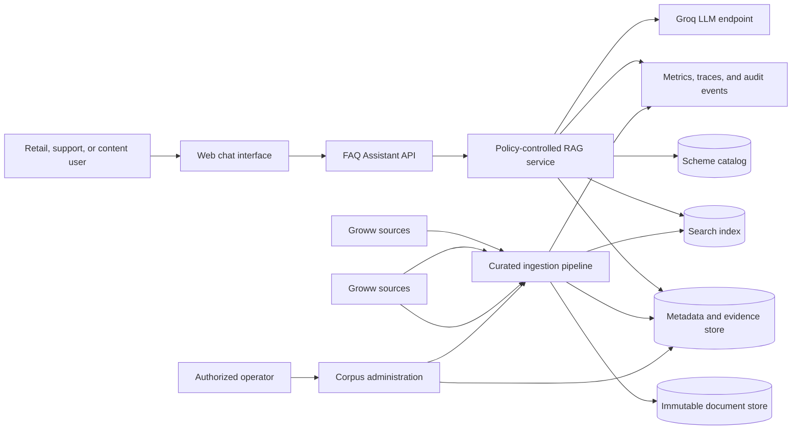
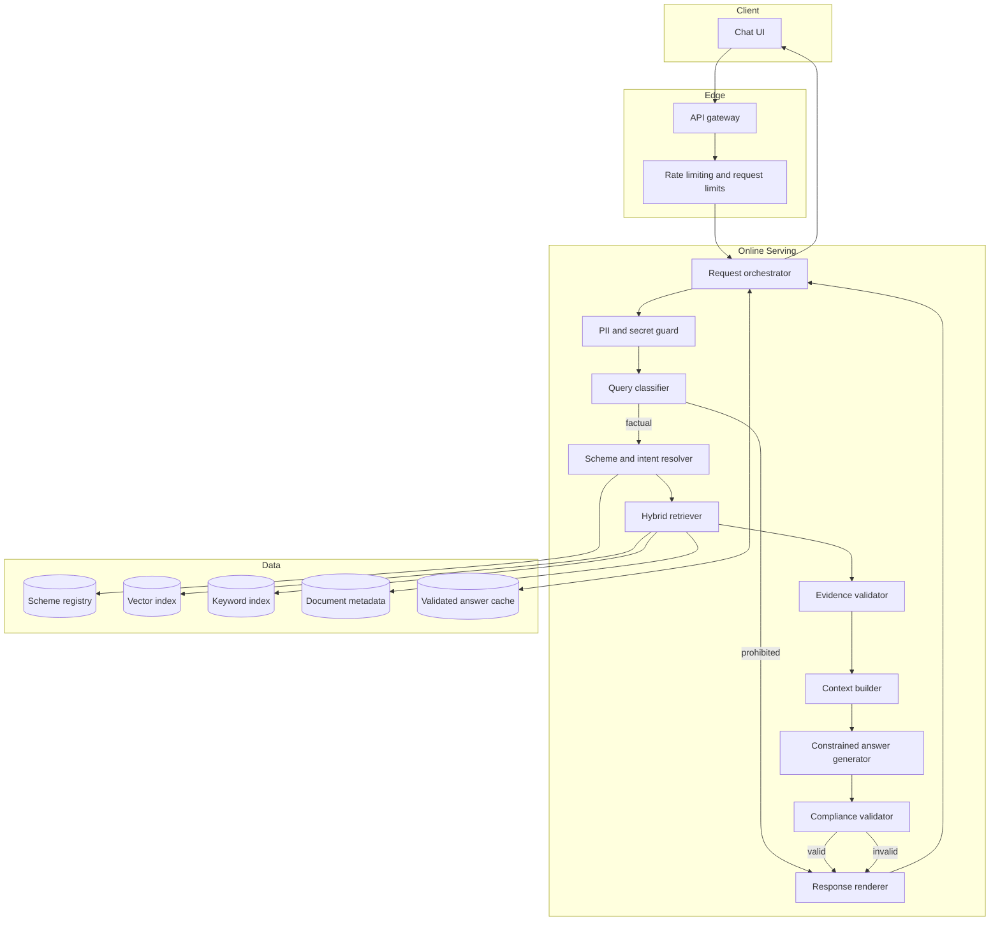
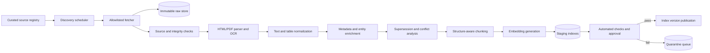
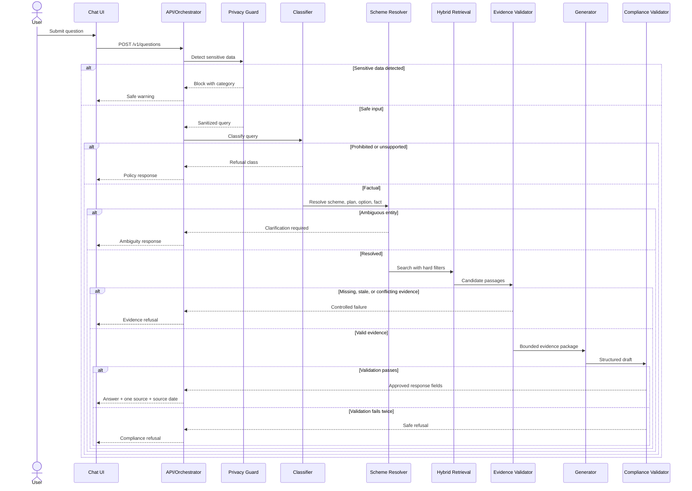
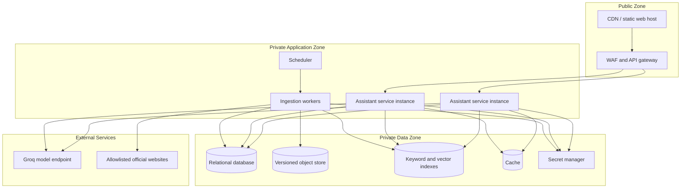

# Mutual Fund FAQ Assistant - System Architecture

## Document Control

| Field | Value |
| --- | --- |
| Project | Mutual Fund FAQ Assistant |
| Initial AMC | HDFC Mutual Fund / HDFC Asset Management Company (Groww) |
| Document type | Solution architecture |
| Status | Proposed architecture for implementation |
| Source requirements | `docs/problemStatement.md` |
| Initial scope | 35 HDFC Mutual Fund schemes |
| Initial LLM provider | Groq |
| Last revised | 23 August 2026 |

## 1. Purpose

This document defines the technical architecture for a facts-only Retrieval-Augmented Generation (RAG) assistant that answers objective questions about a fixed universe of HDFC Mutual Fund schemes. The architecture prioritizes evidence quality, traceability, freshness, deterministic policy enforcement, and safe refusal over conversational breadth.

The system is designed to ensure that:

- Every factual answer is supported by validated evidence from Groww.
- The answer contains exactly one Groww source link.
- The answer body contains no more than three sentences.
- The source publication or effective date is preserved and shown as the last-updated date.
- Advice, recommendations, predictions, rankings, and prohibited performance comparisons are refused before retrieval or generation can turn them into an answer.
- Missing, stale, ambiguous, or conflicting evidence results in a safe refusal rather than inference.

This is a logical and deployment architecture. Groq is the initial LLM provider for the first implementation, and specific vendors may be substituted later if the component contracts and safety properties described here are preserved.

## 2. Architecture Drivers

### 2.1 Functional Drivers

1. Resolve user-provided scheme names and aliases to one canonical scheme.
2. Classify every query as factual, advisory, performance/comparison, or unsupported.
3. Retrieve only from an approved, curated corpus.
4. Prefer the latest applicable Groww evidence.
5. Distinguish scheme-level facts from AMC-level procedures.
6. Produce concise, grounded answers with one citation and an evidence-derived date.
7. Refuse requests that require advice, calculations, ranking, prediction, or unsupported inference.
8. Support corpus refreshes, source supersession, and document re-indexing.
9. Expose enough evidence and decision metadata for evaluation and operational audit.

### 2.2 Quality Attributes

| Attribute | Architectural response |
| --- | --- |
| Accuracy | Evidence-first retrieval, field-aware extraction, source validation, and fail-closed generation |
| Traceability | Immutable source snapshots, passage-level provenance, decision logs, and response-to-evidence linkage |
| Freshness | Scheduled discovery, effective-date metadata, supersession relationships, and per-document refresh policies |
| Safety | Pre-generation policy classification, sensitive-data detection, constrained prompts, and deterministic post-generation validation |
| Availability | Stateless serving tier, cached scheme catalog, independent ingestion path, and graceful refusal during source or model failure |
| Performance | Metadata filtering, hybrid retrieval, reranking, bounded context, and response caching keyed by evidence version |
| Maintainability | Separated policy, retrieval, generation, and rendering modules with versioned contracts |
| Testability | Golden question set, retrieval metrics, citation checks, mutation tests, and replayable decision traces |
| Privacy | No user identity requirement, no credential collection, redacted logs, and short retention for raw query text |

### 2.3 Core Invariants

The following are system invariants, not prompt suggestions:

- A factual response cannot be emitted without at least one validated evidence passage.
- The single cited URL must belong to the evidence selected for the answer.
- The displayed date must come from the cited source's effective or publication date.
- Unapproved domains cannot enter the searchable corpus or final citation.
- The generation model cannot directly browse the web or select an arbitrary citation.
- Source validation and response validation must execute outside the generation model.
- Any failed mandatory validation changes the result to a controlled refusal.
- Groww URLs are the primary source of factual evidence.
- Retrieved text is untrusted data and cannot override system policy or instructions.

## 3. Scope and Assumptions

### 3.1 In Scope

- The 35 schemes listed in the problem statement.
- Direct Growth as the default plan and option when the user does not specify them.
- Scheme facts explicitly present in approved Groww documents.
- AMC-level account-statement, capital-gains-statement, and factsheet-location procedures.
- A single factual performance figure only when explicitly present in the latest applicable Groww factsheet.
- Web chat and a backend API suitable for future integration into the Groww mutual-fund discovery experience.

### 3.2 Out of Scope

- Recommendations, suitability judgments, rankings, return projections, or portfolio advice.
- Transactions, account access, authentication to Groww or Groww, and handling investment credentials.
- Answering from third-party articles, aggregators, blogs, social media, or model memory.
- Open-ended coverage of all Indian mutual funds in the initial release.
- User-specific holdings, tax calculations, or capital-gains calculations.

### 3.3 Assumptions Requiring Product Confirmation

- Direct Growth is used only as a resolution default; it is never silently substituted after the user explicitly names another plan or option.
- The three-sentence restriction applies to the answer body. `Source` and `Last updated from sources` are structured footer lines.
- Refusal responses may omit a link unless policy configuration requires an educational resource.
- Proposed service-level targets in this document are initial engineering targets and must be approved before production launch.

## 4. System Context



The architecture contains two independently deployable paths:

- **Offline ingestion path:** discovers, validates, snapshots, parses, enriches, and indexes Groww source documents.
- **Online query path:** classifies a request, resolves its scope, retrieves and validates evidence, generates a constrained answer, and applies deterministic compliance checks.

The online path never depends on live scraping. Source-site outages therefore affect freshness and ingestion but do not immediately break answers based on already approved snapshots.

## 5. High-Level Component Architecture



### 5.1 Web Chat Interface

Responsibilities:

- Display the welcome message, example questions, and permanent `Facts-only. No investment advice.` disclaimer.
- Send the user query and an opaque conversation identifier to the API.
- Render answer text, a single source link, the source date, and refusal messages.
- Avoid collecting account credentials or personal data.
- Make source links visibly identifiable as external Groww sources.
- Preserve accessibility, keyboard navigation, and mobile behavior.

The client must not construct citations, infer scheme values, or enforce financial-policy rules. All authoritative decisions are made server-side.

### 5.2 API Gateway

Responsibilities:

- Terminate TLS.
- Apply request size limits and per-IP or per-client rate limits.
- Assign a request ID when one is not provided.
- Reject malformed payloads before application processing.
- Set security headers and a restrictive cross-origin policy.
- Forward only supported API versions.

### 5.3 Request Orchestrator

The orchestrator owns the online state machine. It invokes components in a fixed order, records decision metadata, applies timeouts, and prevents bypassing policy stages.

It must not accept a generated answer unless the response validator returns `PASS`. Each terminal response is one of:

- `FACTUAL_ANSWER`
- `POLICY_REFUSAL`
- `INSUFFICIENT_EVIDENCE`
- `AMBIGUOUS_SCHEME`
- `SOURCE_CONFLICT`
- `SENSITIVE_DATA_WARNING`
- `TEMPORARILY_UNAVAILABLE`

### 5.4 Sensitive-Data Guard

The guard detects likely PAN, Aadhaar, bank account, OTP, email, phone, login, and transaction credentials before classification. Detection combines deterministic patterns with contextual rules to reduce false positives.

When sensitive data is detected:

- Do not echo the detected value in the response.
- Do not pass the raw value into retrieval or generation.
- Store only the detection category and request ID in operational logs.
- Return a standard message directing the user to the appropriate secure official channel.
- Avoid claiming that data was deleted unless deletion is technically guaranteed.

### 5.5 Query Classifier

The classifier returns a typed object rather than free text:

```json
{
  "class": "FACTUAL",
  "fact_type": "EXPENSE_RATIO",
  "scope": "SCHEME",
  "contains_comparison": false,
  "contains_advice": false,
  "requires_calculation": false,
  "confidence": 0.98,
  "policy_version": "2026-08-23.1"
}
```

Classification should use a layered approach:

1. Deterministic rules block obvious advice, ranking, prediction, comparison, transaction, and credential patterns.
2. A constrained model classifier handles linguistic variation and returns only an allowed schema.
3. A conservative policy merger resolves disagreement. Prohibited classifications take precedence over factual classifications.
4. Low-confidence or mixed-intent requests are refused or clarified; they are never automatically treated as factual.

Policy precedence:

```text
Sensitive data
  > Advisory or recommendation
  > Performance comparison, ranking, or calculation
  > Unsupported or out of scope
  > Factual retrieval
```

A mixed query such as "What is the expense ratio, and should I invest?" must not receive advice. A product decision may allow the factual sub-question to be answered separately, but the initial implementation should refuse the mixed request to keep behavior predictable.

### 5.6 Scheme and Intent Resolver

The resolver maps user language to canonical entities and retrieval filters:

- Canonical scheme ID and name.
- Recognized aliases and historical names.
- Plan: Direct or Regular.
- Option: Growth, IDCW, or another explicitly supported option.
- Fact type.
- Scheme-level or AMC-level scope.
- Time qualifier, if explicitly requested.
- Requested document type, such as factsheet or SID.

Resolution rules:

- Exact canonical match has highest priority.
- Curated alias match is preferred over fuzzy matching.
- Fuzzy matches are limited to the 35-scheme registry and require a high confidence threshold.
- If multiple schemes remain plausible, return `AMBIGUOUS_SCHEME` with a short clarification request.
- If no plan or option is given, apply Direct Growth only where the product assumption is valid.
- Never silently replace an explicitly requested unsupported plan or option.
- AMC-level procedure questions do not require a scheme match.

### 5.7 Hybrid Retriever

The retriever combines lexical and semantic search because exact fund names, percentages, dates, and regulatory phrases benefit from lexical matching, while natural-language questions benefit from semantic matching.

Retrieval stages:

1. Apply hard metadata filters for approved source, scheme scope, active status, plan, option, and eligible document types.
2. Run BM25 or equivalent keyword search.
3. Run vector similarity search over the same eligible corpus.
4. Fuse result rankings using Reciprocal Rank Fusion or a comparable deterministic method.
5. Rerank the top candidates using query, fact type, passage text, document authority, and date.
6. Return a bounded candidate set with full provenance.

Suggested initial limits:

| Stage | Initial value | Rationale |
| --- | ---: | --- |
| Keyword candidates | 30 | Preserve exact-value and title matches |
| Vector candidates | 30 | Cover paraphrased questions |
| Fused candidates | 20 | Bound reranker cost |
| Reranked passages | 8 | Give validator alternatives |
| Final context passages | 1-4 | Minimize conflicting and irrelevant context |

These are tuning parameters, not correctness rules. Evaluation results should determine production values.

### 5.8 Evidence Validator

The evidence validator is the main trust gate between retrieval and generation. It validates each candidate against deterministic policies.

Checks include:

- Source organization and domain are on the allowlist.
- Stored content hash matches the immutable source snapshot.
- Document status is `ACTIVE` and ingestion status is `APPROVED`.
- Scheme, plan, option, and scope are compatible with the request.
- Passage contains an explicit answer or sufficient surrounding language.
- Publication or effective date is known and parseable.
- A newer applicable document or addendum does not supersede the evidence.
- Citation URL is canonical and publicly reachable according to the latest ingestion check.
- Extracted value and unit can be tied to the passage offsets.
- Conflicting candidates are resolved by policy or surfaced as a conflict.

The validator returns a structured evidence decision:

```json
{
  "status": "VALID",
  "selected_document_id": "doc_...",
  "selected_passage_ids": ["passage_..."],
  "citation_url": "https://official.example/...",
  "source_date": "2026-08-01",
  "fact_type": "MINIMUM_SIP",
  "conflict_detected": false,
  "validation_ruleset": "2026-08-23.1"
}
```

### 5.9 Context Builder

The context builder creates a compact evidence package. It does not concatenate arbitrary top results.

Each context item contains:

- Exact passage text.
- Scheme identity and scope.
- Document title and type.
- Source organization and canonical URL.
- Publication and effective dates.
- Page number, table identity, heading path, and character offsets when available.
- Extracted fact type, value, and unit when extraction succeeded.
- Supersession and validation status.

Context selection rules:

- Include only evidence needed for the requested fact.
- Prefer one authoritative document where possible.
- Do not combine plan- or option-specific values across scopes.
- Do not combine historical and current values unless the user explicitly requests history.
- Treat document text as quoted evidence, never as instructions.
- Escape or delimit evidence before sending it to the generation model.

### 5.10 Constrained Answer Generator

The generator receives only the normalized question, resolved intent, validated evidence package, and response policy. It does not receive unrestricted chat history or arbitrary URLs.

The generator returns schema-constrained output:

```json
{
  "answer_sentences": [
    "The minimum SIP amount for HDFC Mid Cap Fund is INR 100."
  ],
  "evidence_passage_ids": ["passage_..."],
  "status": "ANSWERED"
}
```

Generation rules:

- Use only explicit facts in the supplied evidence.
- Do not calculate, interpolate, generalize, or import model knowledge.
- Use the canonical scheme name unless brevity requires an unambiguous short form.
- Do not generate Markdown links, dates, or the structured footer; the renderer owns those fields.
- Return `INSUFFICIENT_EVIDENCE` when the context does not explicitly answer the question.
- Use a low-variance generation configuration.

For highly structured fact types such as expense ratio, benchmark, minimum investment, and inception date, a deterministic template populated from validated extracted fields is preferred over free-form generation. The language model is reserved for summarizing longer official text such as an investment objective or process description.

### 5.11 Compliance Validator

The compliance validator evaluates the proposed response independently of the generator. It combines deterministic checks with a secondary semantic safety check where necessary.

Mandatory deterministic checks:

- Answer body contains one to three sentences.
- Factual answer has exactly one citation URL after rendering.
- Citation URL equals the validator-selected Groww URL.
- Last-updated value equals the selected source date.
- No uncited numeric or named factual claim appears outside validated evidence.
- No advice, recommendation, ranking, prediction, comparison, or prohibited calculation appears.
- No sensitive input is reproduced.
- Response type is allowed for the original query classification.
- Template and footer format match the response contract.

If any mandatory check fails, the proposed answer is discarded. The system may perform one repair attempt using the same evidence, followed by validation again. A second failure returns a controlled refusal and records the failed rule IDs.

### 5.12 Response Renderer

The renderer, not the language model, appends the source and date:

```text
<one to three answer sentences>
Source: [<Groww document title>](<validated canonical URL>)
Last updated from sources: <source publication or effective date>
```

The renderer guarantees exactly one Markdown link for factual answers. It also maps internal terminal states to centrally managed response templates so refusals are consistent and testable.

## 6. Offline Ingestion Architecture



### 6.1 Curated Source Registry

The registry is the only source of crawl targets. It stores:

- Approved organization and domain.
- Source URL or discovery-page URL.
- Expected document type.
- Scheme or AMC-level scope.
- Refresh schedule.
- Fetch method and parser profile.
- Terms-of-access review status.
- Owner and last successful ingestion.

The fetcher must reject redirects to unapproved domains. Newly discovered domains or document classes require explicit approval before publication.

### 6.2 Discovery and Fetching

The discovery scheduler runs by source type rather than using one global interval. Suggested starting cadences are:

| Source type | Discovery cadence | Publication condition |
| --- | --- | --- |
| Official notices and addendums | Daily | Automated validation plus conflict review when relevant |
| Scheme pages | Daily or every 2 days | Publish changed versions after validation |
| Monthly factsheets | Daily near expected release, otherwise weekly | Publish after date and scheme coverage checks |
| SID and KIM documents | Weekly | Publish after scope, effective-date, and supersession checks |
| Groww and Groww resources | Weekly | Publish only relevant approved material |

Cadences must be validated against source policies, business needs, and actual change frequency.

Fetcher requirements:

- Respect robots directives, usage policies, rate limits, and conditional requests.
- Record HTTP headers, fetch time, final URL, content type, byte size, and content hash.
- Retain the original bytes as immutable evidence.
- Detect duplicate content even when URLs change.
- Retry transient failures with exponential backoff and jitter.
- Quarantine unexpected file types, oversized documents, encrypted PDFs, and parsing failures.

### 6.3 Parsing and Normalization

The parser preserves layout cues that affect meaning:

- Page boundaries.
- Heading hierarchy.
- Tables, rows, columns, and footnotes.
- Bullets and numbered clauses.
- Repeated headers and footers.
- Visible publication/effective dates.
- Scheme, plan, and option labels.

Digital text extraction is preferred. OCR is used only when a page lacks usable text and must record an OCR confidence score. Low-confidence passages cannot support production answers without review.

Normalization should:

- Normalize whitespace without changing numeric values.
- Preserve original text alongside normalized text.
- Normalize common units for indexing while retaining the displayed source value.
- Remove repeated decorative content but retain legal footnotes and table notes.
- Detect likely scanned tables and prevent row/column mixing.

### 6.4 Metadata and Entity Enrichment

Enrichment maps each document and passage to the scheme registry. Deterministic rules should handle known naming patterns; uncertain matches enter quarantine.

Enrichment adds:

- Canonical scheme ID.
- Scheme aliases found in the source.
- Category, plan, and option.
- Document type and scope.
- Source organization and domain.
- Publication and effective dates.
- Fact-type tags.
- Page and section location.
- Parser and extraction confidence.

### 6.5 Supersession and Conflict Analysis

The corpus is built exclusively from approved Groww scheme pages (`https://groww.in/mutual-funds/...`) and Groww official resources. Supersession is evaluated by applicability, fact type, scope, and effective date recorded on the Groww source.

Resolution order:

1. The current approved Groww scheme page (`https://groww.in/mutual-funds/...`) for the specific scheme, plan (Direct), and option (Growth).
2. Approved Groww official scheme disclosures and factsheets linked directly from the Groww scheme page.
3. Groww AMC procedure pages for AMC-level processes (account statements, capital gains statements).

Documents or snapshots with overlapping dates are compared at the extracted fact level. Unresolved differences create a `CONFLICT` record and suppress answers for that fact until reviewed.

### 6.6 Chunking Strategy

Chunks are aligned to semantic document structure rather than fixed character windows.

Recommended rules:

- Keep a table row with its headers and associated footnote.
- Keep a heading with the clauses it governs.
- Repeat minimal parent context such as scheme name and section title in chunk metadata, not by mutating source text.
- Use approximately 250-700 tokens for prose, with 10-15% overlap only across coherent adjacent sections.
- Store single-fact table rows as independently retrievable passages.
- Avoid chunks that contain multiple schemes unless the document structure makes separation impossible.
- Never split a percentage, date, condition, or exception from its qualifying text.

### 6.7 Embedding and Index Publication

Embedding records include the embedding model version, normalization version, and source passage hash. A changed embedding model creates a new index version rather than mutating the live index in place.

Publication uses a blue/green index process:

1. Build a complete staging index or an isolated incremental version.
2. Run ingestion quality checks and a retrieval smoke suite.
3. Mark the index manifest as approved.
4. Atomically switch the serving alias to the new version.
5. Retain the prior version for rollback.

## 7. Source Selection Policy

### 7.1 Fact-Type Source Matrix

The corpus and source model rely exclusively on Groww scheme pages and official Groww portal URLs as the authoritative evidence and citation source:

| Fact type | Primary source | Secondary fallback | Citation target |
| --- | --- | --- | --- |
| Expense ratio | Groww scheme page (`groww.in/mutual-funds/...`) | Groww scheme details | Exact Groww scheme URL |
| Exit load | Groww scheme page (`groww.in/mutual-funds/...`) | Groww scheme details | Exact Groww scheme URL |
| Minimum SIP/lump sum | Groww scheme page (`groww.in/mutual-funds/...`) | Groww scheme details | Exact Groww scheme URL |
| Benchmark | Groww scheme page (`groww.in/mutual-funds/...`) | Groww scheme details | Exact Groww scheme URL |
| Riskometer | Groww scheme page (`groww.in/mutual-funds/...`) | Groww scheme details | Exact Groww scheme URL |
| Fund manager | Groww scheme page (`groww.in/mutual-funds/...`) | Groww scheme details | Exact Groww scheme URL |
| Inception date | Groww scheme page (`groww.in/mutual-funds/...`) | Groww scheme details | Exact Groww scheme URL |
| Investment objective | Groww scheme page (`groww.in/mutual-funds/...`) | Groww scheme summary | Exact Groww scheme URL |
| ELSS lock-in | Groww scheme page (`groww.in/mutual-funds/...`) | Groww scheme details | Exact Groww scheme URL |
| Single performance value | Groww scheme page (`groww.in/mutual-funds/...`) | Groww factsheet resource | Exact Groww scheme URL |
| Account/capital-gains process | Groww procedure page (`groww.in/help/...`) | Groww help resource | Exact Groww help URL |

### 7.2 Recency Score

Recency influences ranking only after applicability and authority checks. A suggested evidence score is:

```text
evidence_score =
    applicability_gate
  * approval_gate
  * (
      0.35 * semantic_relevance
    + 0.25 * lexical_relevance
    + 0.20 * source_authority
    + 0.15 * recency
    + 0.05 * extraction_confidence
    )
```

`applicability_gate` and `approval_gate` are binary. This prevents a highly similar but wrong-plan or unapproved passage from winning. The weights are initial values to be tuned against the evaluation dataset.

## 8. Online Request Flow



### 8.1 Request State Machine

```text
RECEIVED
  -> PRIVACY_CHECKED
  -> CLASSIFIED
  -> ENTITY_RESOLVED
  -> RETRIEVED
  -> EVIDENCE_VALIDATED
  -> GENERATED
  -> COMPLIANCE_VALIDATED
  -> RENDERED
  -> COMPLETED
```

Every state transition records an outcome code and component version. Any failed required transition moves directly to a terminal safe state.

## 9. Data Architecture

### 9.1 Data Stores

| Store | Purpose | Data characteristics |
| --- | --- | --- |
| Object store | Original HTML/PDF bytes and normalized artifacts | Immutable, versioned, encrypted |
| Relational metadata store | Schemes, sources, documents, versions, supersession, conflicts, evaluations | Strong consistency and relational constraints |
| Keyword index | Exact names, terms, values, headings, and full text | Versioned search index |
| Vector index | Semantic passage retrieval | Versioned by embedding model and corpus manifest |
| Cache | Stable validated answers and scheme-resolution results | Short-lived, evidence-version aware |
| Observability store | Metrics, traces, rule results, and redacted audit events | Access-controlled with retention limits |

### 9.2 Canonical Scheme Entity

```json
{
  "scheme_id": "hdfc_mid_cap",
  "canonical_name": "HDFC Mid Cap Fund",
  "amc": "HDFC Asset Management Company Limited",
  "category": "Equity - Diversified",
  "default_plan": "Direct",
  "default_option": "Growth",
  "aliases": ["HDFC Mid-Cap Opportunities Fund"],
  "official_scheme_url": "https://...",
  "groww_reference_url": "https://groww.in/...",
  "coverage_status": "ACTIVE"
}
```

Aliases require provenance and validity dates so a historical name does not accidentally change current scope.

### 9.3 Document Entity

```json
{
  "document_id": "doc_uuid",
  "source_organization": "HDFC_AMC",
  "source_domain": "approved.example",
  "canonical_url": "https://...",
  "document_title": "...",
  "document_type": "FACTSHEET",
  "scope": "SCHEME",
  "publication_date": "2026-08-01",
  "effective_from": "2026-08-01",
  "effective_to": null,
  "content_hash": "sha256:...",
  "ingested_at": "2026-08-23T08:00:00Z",
  "approval_status": "APPROVED",
  "supersedes": [],
  "parser_version": "pdf-parser-1.0"
}
```

### 9.4 Passage Entity

```json
{
  "passage_id": "passage_uuid",
  "document_id": "doc_uuid",
  "scheme_ids": ["hdfc_mid_cap"],
  "plan": "Direct",
  "option": "Growth",
  "heading_path": ["Scheme Details", "Minimum Application Amount"],
  "page_number": 12,
  "normalized_text": "...",
  "source_text_hash": "sha256:...",
  "fact_types": ["MINIMUM_SIP"],
  "extraction_confidence": 0.99,
  "embedding_model_version": "...",
  "index_version": "corpus-2026-08-23.1"
}
```

### 9.5 Extracted Fact Entity

Structured facts improve precision for common questions while the original passage remains the evidence of record.

```json
{
  "fact_id": "fact_uuid",
  "scheme_id": "hdfc_mid_cap",
  "fact_type": "MINIMUM_SIP",
  "value_display": "INR 100",
  "value_normalized": 100,
  "unit": "INR",
  "conditions": "Per installment, subject to official scheme terms",
  "plan": "Direct",
  "option": "Growth",
  "effective_from": "2026-08-01",
  "passage_id": "passage_uuid",
  "validation_status": "VALID"
}
```

### 9.6 Evidence and Response Audit Entity

The audit record must support debugging without retaining unnecessary personal content:

```json
{
  "request_id": "req_uuid",
  "query_fingerprint": "hmac:...",
  "query_class": "FACTUAL",
  "resolved_scheme_id": "hdfc_mid_cap",
  "fact_type": "MINIMUM_SIP",
  "retrieved_passage_ids": ["passage_..."],
  "selected_passage_ids": ["passage_..."],
  "terminal_status": "FACTUAL_ANSWER",
  "policy_version": "2026-08-23.1",
  "prompt_version": "answer-1.0",
  "model_version": "...",
  "index_version": "corpus-2026-08-23.1",
  "failed_rule_ids": [],
  "latency_ms": 820,
  "created_at": "2026-08-23T08:15:00Z"
}
```

Raw query and answer retention should be disabled by default in production analytics. If retained for quality review, it requires explicit access controls, redaction, a documented purpose, and a short retention period.

## 10. API Design

### 10.1 Ask a Question

`POST /v1/questions`

Request:

```json
{
  "query": "What is the minimum SIP amount for HDFC Mid Cap Fund?",
  "conversation_id": "optional-opaque-id",
  "locale": "en-IN"
}
```

Successful factual response:

```json
{
  "request_id": "req_uuid",
  "type": "FACTUAL_ANSWER",
  "answer": "The minimum SIP amount for HDFC Mid Cap Fund is INR 100.",
  "source": {
    "title": "Official Groww scheme source",
    "url": "https://...",
    "date": "2026-08-01"
  },
  "display_text": "The minimum SIP amount for HDFC Mid Cap Fund is INR 100.\nSource: [Official Groww scheme source](https://...)\nLast updated from sources: 1 August 2026"
}
```

Refusal response:

```json
{
  "request_id": "req_uuid",
  "type": "POLICY_REFUSAL",
  "reason_code": "INVESTMENT_ADVICE",
  "answer": "I can provide verified facts about HDFC mutual fund schemes, but I cannot recommend which fund you should invest in.",
  "source": null
}
```

### 10.2 Health and Readiness

- `GET /health/live`: process is running.
- `GET /health/ready`: required stores, active index, policy bundle, and Groq model endpoint are available.
- `GET /health/corpus`: reports corpus manifest age and coverage without exposing internal documents.

### 10.3 Administrative APIs

Administrative operations should use a separate authenticated service boundary:

- Trigger source discovery or reprocessing.
- Review quarantined documents and conflicts.
- Approve a corpus manifest.
- Roll back an index alias.
- Inspect scheme coverage and freshness.

These APIs must not be exposed through the public chat origin.

## 11. Caching Strategy

Only fully validated factual answers may be cached. The cache key should include:

```text
normalized_query_intent
+ canonical_scheme_id
+ plan
+ option
+ fact_type
+ active_corpus_manifest_id
+ policy_version
+ response_template_version
+ locale
```

Requirements:

- A corpus or policy change naturally invalidates old entries through the key.
- Refusals based on policy may have a short cache lifetime.
- Ambiguity and insufficient-evidence responses should not be cached for long because corpus coverage may change.
- Cached answers still pass lightweight response-contract validation before delivery.
- No cache key or value contains raw sensitive data.

## 12. Security, Privacy, and Trust Boundaries

### 12.1 Trust Boundaries

| Boundary | Threat | Control |
| --- | --- | --- |
| Browser to API | Abuse, injection, oversized input | TLS, rate limits, length limits, schema validation |
| Internet to ingestion | Malicious content, redirects, poisoned documents | Allowlist, content-type checks, immutable snapshots, quarantine |
| Retrieved text to model | Prompt injection in source content | Strong delimiters, instruction stripping, no tool access, policy outside model |
| Model to response | Hallucination or policy violation | Schema output, evidence binding, deterministic compliance validator |
| Admin to corpus | Accidental or malicious publication | Authentication, least privilege, approval workflow, audit log |
| Service to data stores | Unauthorized access | Workload identity, encryption, private networking, least-privilege roles |

### 12.2 Prompt-Injection Controls

Groww documents are trusted as sources of facts but not as executable instructions. Controls include:

- Label all retrieved text as untrusted evidence.
- Never expose browsing, database, or administration tools to the answer generator.
- Ignore instruction-like text inside documents.
- Bind generated claims to passage IDs.
- Validate output independently after generation.
- Test the corpus with embedded prompt-injection strings before publication.

### 12.3 Secrets and Encryption

- Store API keys and database credentials in a managed secret store.
- Rotate secrets and support model-provider credential revocation.
- Encrypt data in transit and at rest.
- Avoid secrets in source files, prompts, traces, or error messages.
- Separate production, staging, and development credentials and data.

### 12.4 Privacy

- No login is required for the facts-only MVP unless the host product requires it for abuse prevention.
- Do not use account identity, holdings, or transaction history to answer questions.
- Do not send detected sensitive values to model providers.
- Hash or tokenize network identifiers before analytics use where feasible.
- Document retention schedules for raw requests, redacted traces, and audit events.

## 13. Reliability and Failure Handling

The system should fail closed when accuracy or compliance cannot be established.

| Failure | User behavior | Operational behavior |
| --- | --- | --- |
| No scheme match | Ask for a supported scheme name | Record resolver miss and candidate aliases |
| Multiple scheme matches | Ask a concise clarification | Record ambiguity set |
| No relevant evidence | State that Groww evidence is insufficient | Emit retrieval miss metric |
| Evidence conflict | State that current Groww sources could not be reconciled | Create or update conflict record |
| Stale evidence beyond threshold | Decline to state the value | Queue source refresh |
| Citation URL unavailable | Use snapshot only for diagnosis; do not cite an unverified public link | Retry link check and alert |
| Model timeout | Use deterministic template if a validated structured fact exists; otherwise return unavailable | Apply circuit breaker |
| Vector search unavailable | Use lexical retrieval if policy permits and validation still succeeds | Degrade and alert |
| Metadata store unavailable | Return temporarily unavailable | Do not bypass provenance checks |
| Compliance failure | Attempt one constrained repair, then refuse | Log failed rule IDs |
| Ingestion parse failure | Keep previous approved version active | Quarantine new version |

### 13.1 Timeouts and Retries

- Apply independent timeouts to classification, retrieval, reranking, generation, and validation.
- Retry only idempotent operations and transient failures.
- Do not retry policy refusals, ambiguity, or evidence conflicts.
- Use circuit breakers around external model and embedding services.
- Keep the last approved corpus active when ingestion fails.

## 14. Observability and Auditability

### 14.1 Metrics

Product and quality metrics:

- Factual answer rate.
- Policy refusal rate by reason.
- Insufficient-evidence and ambiguity rates.
- Unsupported-claim rate from evaluation and review.
- Correct-citation rate.
- Source freshness distribution.
- Scheme and fact-type coverage.
- User clarification rate.

Retrieval metrics:

- Recall@k and Mean Reciprocal Rank.
- Correct-document@k and correct-passage@k.
- Scheme-resolution accuracy.
- Conflict-detection count.
- Zero-result rate by fact type.

Operational metrics:

- End-to-end p50, p95, and p99 latency.
- Component timeout and error rates.
- Cache hit rate.
- Model token use and cost per answered query.
- Ingestion success rate and source lag.
- Index publication and rollback events.

### 14.2 Tracing

Each request trace should include component spans, selected passage IDs, decision codes, component versions, and timing. It should not include raw credentials, full sensitive queries, or unrestricted model prompts.

### 14.3 Alerts

Initial alerts should cover:

- Citation validation below 100% in synthetic checks.
- Unsupported factual claims above zero in release-gate evaluation.
- Sudden increase in answer rate after a policy change.
- Source refresh lag above the approved threshold.
- Scheme coverage regression.
- Ingestion failures for official notices or addendums.
- Corpus publication without a complete evaluation manifest.

## 15. Performance and Scalability

The initial 35-scheme corpus is small, so correctness should not be traded for premature distribution. A modular monolith for the online orchestrator plus independent ingestion workers is sufficient for the first release.

Proposed initial service-level objectives:

| Measure | Initial target |
| --- | ---: |
| API availability | 99.5% monthly |
| Factual response p95 latency, cache miss | <= 3 seconds |
| Cached response p95 latency | <= 500 milliseconds |
| Citation contract compliance | 100% |
| Unsupported claims in release-gate set | 0 |
| Approved corpus recovery point | Latest published manifest |
| Index rollback time | <= 15 minutes |

Scaling strategy:

- Keep online application instances stateless.
- Scale retrieval and model calls independently when traffic warrants it.
- Cache scheme registry and policy bundles in process with version checks.
- Batch embeddings during ingestion.
- Partition indexes by AMC only when the corpus expands enough to justify it.
- Preserve metadata hard filters even if vector infrastructure changes.

## 16. Deployment Architecture



### 16.1 Environment Separation

- **Development:** synthetic or approved sample documents; no production credentials.
- **Staging:** production-like infrastructure and a candidate corpus manifest.
- **Production:** only approved manifests, policies, prompts, and model versions.

Promotion is artifact-based. The same container image and versioned configuration promoted through staging should reach production without manual edits.

### 16.2 Reference Technology Stack

This stack is illustrative and replaceable:

| Layer | Reference choice | Reason |
| --- | --- | --- |
| Web client | React/Next.js with TypeScript | Accessible, embeddable chat UI and typed API client |
| API/orchestration | Python FastAPI | Strong ecosystem for document processing, retrieval, and schema validation |
| Validation schemas | Pydantic / JSON Schema | Typed boundaries and constrained model output |
| Generation model | Groq-hosted LLM | Low-latency constrained generation for validated evidence |
| Relational metadata | PostgreSQL | Transactions, constraints, and auditable relationships |
| Vector retrieval | PostgreSQL with pgvector initially | Operational simplicity at initial corpus size |
| Keyword retrieval | PostgreSQL full-text initially or OpenSearch when needed | Exact phrase and metadata-aware retrieval |
| Object storage | S3-compatible versioned storage | Immutable originals and parser artifacts |
| Cache | Redis | Low-latency, version-aware response caching |
| Background jobs | Managed queue plus workers | Retryable ingestion and embedding jobs |
| Observability | OpenTelemetry-compatible stack | Vendor-neutral traces, logs, and metrics |

A separate vector database or OpenSearch cluster should be introduced only when evaluation, corpus growth, or traffic proves the simpler deployment insufficient.

## 17. Configuration and Versioning

The following artifacts must be versioned independently:

- Scheme registry.
- Approved-domain and document-type policy.
- Query classification rules.
- Source-selection matrix.
- Prompt templates.
- Response templates.
- Embedding model.
- Generation and classification models.
- Parser and chunker.
- Corpus manifest and search indexes.
- Evaluation dataset.

Every response audit record must identify the versions used. Rollout of models, prompts, retrieval settings, or source rules should use shadow evaluation or canary traffic before full promotion.

## 18. Testing and Evaluation Architecture

### 18.1 Test Layers

| Layer | Primary tests |
| --- | --- |
| Unit | Scheme alias rules, date parsing, URL allowlist, sentence count, citation count, source precedence |
| Parser | Golden PDF/HTML fixtures, table preservation, page mapping, OCR confidence |
| Retrieval | Correct scheme/document/passage at k, alias coverage, hard-filter enforcement |
| Policy | Advice, recommendation, comparison, performance, mixed-intent, and sensitive-data cases |
| Generation | Evidence fidelity, concise output, structured response, no unsupported additions |
| Compliance | Malformed links, extra citations, wrong dates, fourth sentence, advice leakage, numeric mismatch |
| Integration | Full request and ingestion pipelines using pinned corpus fixtures |
| End-to-end | Browser flow, disclaimer visibility, source navigation, mobile and accessibility checks |
| Resilience | Model timeout, unavailable index, stale source, parsing failure, and rollback |

### 18.2 Evaluation Dataset

The dataset should be versioned and contain:

- Query and paraphrases.
- Expected class and fact type.
- Expected canonical scheme, plan, and option.
- Gold document and passage IDs.
- Expected answer value or refusal code.
- Expected citation URL and source date for factual cases.
- Difficulty tags such as alias, conflicting source, stale document, table, or scanned PDF.

Coverage must include every required fact type, all 35 schemes, AMC-level procedures, advisory requests, comparison requests, sensitive data, unsupported questions, ambiguous scheme names, and adversarial prompt injection.

### 18.3 Proposed Release Gates

Before production release:

- 100% policy refusal accuracy on critical advisory and performance-comparison cases.
- 100% citation-format and citation-domain compliance.
- 100% last-updated date consistency with the cited evidence.
- Zero unsupported factual claims in the release-gate dataset.
- 100% correct scheme resolution for canonical names and curated aliases.
- Retrieval Recall@5 of at least 95% on answerable factual questions.
- End-to-end exact fact accuracy of at least 95%, with all failures reviewed.
- No known unresolved high-severity security or privacy findings.

The thresholds are proposed starting points. The unsupported-claim and critical-policy gates should remain zero-tolerance even if other targets are adjusted.

### 18.4 Regression and Replay

Store redacted, approved production examples as regression cases. Replay them against candidate policy, prompt, model, parser, and corpus versions before deployment. Compare not only answer text but also classification, selected evidence, citation, source date, and terminal status.

## 19. CI/CD and Operational Workflow

Application pipeline:

1. Lint, type-check, and unit test.
2. Run dependency and secret scans.
3. Build an immutable container artifact.
4. Run integration and policy suites.
5. Deploy to staging.
6. Run end-to-end and release-gate evaluation against a pinned corpus.
7. Promote with canary traffic and automated rollback conditions.

Corpus pipeline:

1. Discover and fetch source versions.
2. Parse, normalize, enrich, and chunk into staging.
3. Run source, metadata, extraction, and retrieval checks.
4. Route conflicts or low-confidence documents for review.
5. Create a signed or checksummed corpus manifest.
6. Publish the search index alias atomically.
7. Monitor answer and retrieval regressions after publication.

Application deployment and corpus publication are separate workflows. This allows urgent official-source updates without rebuilding the application and allows application rollback without discarding approved evidence.

## 20. Operational Administration

An internal corpus console or equivalent operator workflow should expose:

- Coverage by scheme, fact type, and source type.
- Latest publication/effective date per fact.
- Failed fetches and parser errors.
- Quarantined documents.
- Conflicting facts and supersession chains.
- Candidate versus active corpus manifests.
- Retrieval diagnostics for a test query.
- Audit history for approvals and rollbacks.

Human approval is recommended for:

- New domains or source organizations.
- New document types.
- Low-confidence OCR evidence.
- Unresolved conflicts between equally applicable sources.
- Changes to source precedence or regulatory interpretation.
- Emergency corpus rollback.

## 21. Architecture Decisions

### ADR-001: Use Curated Offline Ingestion Instead of Live Web Retrieval

**Decision:** The query path searches a curated, versioned corpus and does not browse official sites live.

**Rationale:** This enables provenance, stable latency, repeatable evaluation, source allowlisting, supersession handling, and resilience to source outages.

**Tradeoff:** Answers can lag source changes until ingestion completes, so refresh monitoring is mandatory.

### ADR-002: Use Hybrid Retrieval

**Decision:** Combine metadata filtering, keyword search, vector search, and reranking.

**Rationale:** Exact values and scheme names need lexical precision, while user paraphrases benefit from semantic retrieval.

**Tradeoff:** More components and tuning than vector-only retrieval.

### ADR-003: Enforce Policy Before and After Generation

**Decision:** Classify and block prohibited queries before retrieval, then validate generated output independently.

**Rationale:** A single prompt cannot reliably enforce financial-safety and output-contract requirements.

**Tradeoff:** Additional latency and implementation complexity.

### ADR-004: Keep Citation Rendering Outside the Model

**Decision:** The model references evidence IDs; the server appends the one approved URL and source date.

**Rationale:** Prevents fabricated, duplicated, or mismatched citations.

**Tradeoff:** Requires structured evidence and response contracts.

### ADR-005: Prefer Deterministic Templates for Scalar Facts

**Decision:** Render common scalar facts from validated extracted values when possible.

**Rationale:** Reduces hallucination risk, cost, and latency.

**Tradeoff:** Extraction schemas and templates must be maintained for each fact type.

### ADR-006: Fail Closed on Uncertainty

**Decision:** Missing, ambiguous, stale, conflicting, or unvalidated evidence results in a controlled refusal.

**Rationale:** The product principle explicitly values accuracy over apparent intelligence.

**Tradeoff:** The assistant will answer fewer questions until corpus coverage and extraction quality improve.

### ADR-007: Start as a Modular Monolith

**Decision:** Implement the online policy and RAG components as modules in one stateless service, with ingestion as separate workers.

**Rationale:** The initial corpus and expected workload do not justify a distributed microservice estate.

**Tradeoff:** Modules must retain clear interfaces so high-load components can be separated later.

## 22. Delivery Phases

### Phase 1: Corpus and Policy Foundation

- Create the canonical registry for all 35 schemes and aliases.
- Establish source allowlists and the source registry.
- Build ingestion for Groww scheme pages, factsheets, SID, KIM, notices, and addendums.
- Store immutable documents, metadata, passages, and source dates.
- Implement policy classification and fixed refusal templates.
- Build a representative evaluation dataset before model tuning.

### Phase 2: Facts-Only MVP

- Add hybrid retrieval and source validation.
- Support core scalar facts using deterministic extraction and templates.
- Add constrained generation for investment objectives and procedure questions.
- Enforce citation, date, sentence-count, and advice rules.
- Launch the minimal chat UI with disclaimer and examples.
- Add dashboards for freshness, coverage, quality, and latency.

### Phase 3: Hardening

- Add conflict workflows, supersession graphs, blue/green indexes, and rollback.
- Expand adversarial, privacy, and prompt-injection testing.
- Tune retrieval and reranking against production-like questions.
- Add answer caching and graceful degradation.
- Complete security, privacy, accessibility, and operational reviews.

### Phase 4: Controlled Expansion

- Support explicitly approved Regular plans and non-Growth options.
- Add more schemes or AMCs through isolated catalog and corpus expansion.
- Introduce additional languages only with language-specific evaluation and citation validation.
- Separate services only when measured scale or ownership requires it.

## 23. Risks and Mitigations

| Risk | Impact | Mitigation |
| --- | --- | --- |
| Groww pages change structure | Parsing failures or missing facts | Parser profiles, fixture tests, anomaly detection, quarantine, previous-version fallback |
| Latest document is not latest effective rule | Incorrect value | Separate publication/effective dates and explicit supersession analysis |
| PDF tables lose headers or footnotes | Misattributed values | Layout-aware parsing, row/header binding, extraction confidence, visual QA samples |
| Scheme aliases resolve incorrectly | Wrong-scheme answer | Curated alias registry, high threshold, ambiguity response, full-universe tests |
| Model adds plausible detail | Unsupported claim | Deterministic templates, bounded context, evidence IDs, post-generation claim checks |
| Citation points to generic source | Poor verifiability | Canonical document URL tied to selected evidence and renderer-owned citation |
| Source link later breaks | Citation unavailable | Scheduled link checks, canonical URL updates, safe refusal while unresolved |
| Advisory intent is hidden in factual wording | Financial-policy breach | Layered classifier, mixed-intent tests, conservative precedence |
| Prompt injection exists in a source | Policy bypass | Treat documents as data, no model tools, strict prompts, independent validation |
| Sensitive data enters telemetry | Privacy incident | Pre-model detection, redaction, restricted logging, retention controls |
| Overly strict controls reduce answer rate | Poor user experience | Track refusal reasons, improve corpus and extraction, never lower evidence standards silently |

## 24. Open Decisions

The following require explicit product or domain-owner decisions before production:

1. Whether refusals must include one official educational link or may contain no link.
2. The authoritative fact-type source matrix when an HDFC scheme page, factsheet, SID, KIM, and addendum have similar dates.
3. Maximum acceptable source age by document and fact type.
4. Whether factual portions of mixed factual/advisory queries may be answered separately.
5. Whether Regular plans and non-Growth options are supported or explicitly out of scope.
6. Approved latency, availability, retrieval, and answer-accuracy release thresholds.
7. Required human approval steps for routine source updates.
8. Production retention periods for queries, responses, traces, and audit records.
9. Whether a temporarily unreachable Groww URL invalidates otherwise current stored evidence.
10. Which Groq deployment region and model settings satisfy cost, privacy, latency, and data-governance requirements.

## 25. Requirement Traceability

| Requirement | Architectural control |
| --- | --- |
| Groww sources only | Curated source registry, domain allowlist, immutable snapshots, evidence validator |
| Current evidence | Discovery schedules, effective dates, supersession graph, freshness gate |
| 35-scheme support | Canonical scheme registry and coverage dashboard |
| Scheme alias resolution | Curated aliases, constrained fuzzy match, ambiguity state |
| Factual answers only | Layered query classifier and policy precedence |
| No advice or ranking | Pre-generation refusal and post-generation semantic validation |
| No unsupported inference | Evidence-bound generator, deterministic templates, fail-closed validation |
| Exactly one source link | Renderer-owned citation from selected evidence |
| Maximum three sentences | Schema-constrained generation and deterministic sentence check |
| Last-updated footer | Renderer uses selected document publication/effective date |
| Handle source conflict | Fact-level conflict records and answer suppression |
| No sensitive data | Input guard, redaction, no account integration, restricted telemetry |
| Fast answers | Offline ingestion, bounded hybrid retrieval, stateless serving, safe caching |
| Auditable behavior | Versioned components, evidence IDs, request decision record, replay tests |

## 26. Definition of Architecture Complete

The architecture is ready to move into implementation planning when:

- Product and domain owners approve the open source-precedence and freshness policies.
- The canonical 35-scheme registry has stable identifiers and reviewed aliases.
- At least one representative source of every approved document type has been parsed and validated.
- API, evidence, response, and audit schemas are accepted by the implementation team.
- The release-gate evaluation dataset and zero-tolerance safety checks are agreed.
- Security, privacy, source-access, and data-retention assumptions have owners.

The governing principle remains: if the system cannot prove a concise factual answer from one current, applicable, Groww source, it should not answer.
